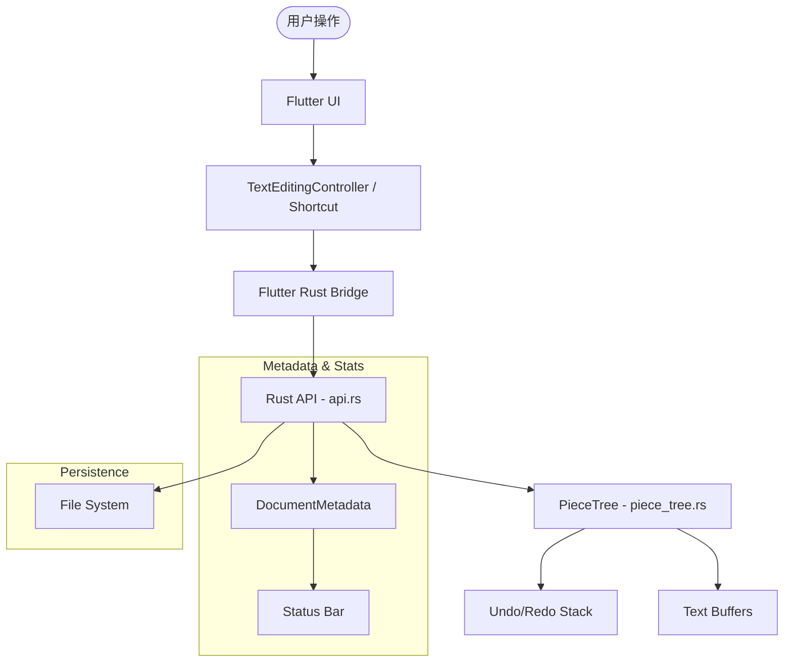

# Velum 开发计划 - 阶段 2：核心功能增强与 UI 完善

## 1. 架构概览
Velum 采用 Rust (velum_core) 作为核心逻辑层，通过 `flutter_rust_bridge` 与 Flutter (velum_ui) 进行通信。目前已实现基础的 Piece Tree 文本编辑、撤销/重做以及简单的 UI 同步。

## 2. 待实现功能模块

### A. Rust 核心层 (velum_core) 增强
- [ ] **富文本支持基础**：在 `PieceTree` 中引入属性（Attributes）支持，为加粗、倾斜、字体大小等功能打下基础。
- [ ] **持久化优化**：实现真正的文件系统读写（目前仅有 JSON 序列化字符串），支持 `.vlm` (自定义格式) 和 `.txt` 导出。
- [ ] **搜索增强**：支持正则表达式搜索和区分大小写的选项。

### B. Flutter UI 层 (velum_ui) 完善
- [ ] **状态栏 (Status Bar)**：显示实时字数统计、字符数、当前行号/列号（通过调用 Rust API）。
- [ ] **工具栏 (Toolbar)**：添加撤销、重做、保存、打开文件的按钮。
- [ ] **编辑体验优化**：
    - 改进 `_onChanged` 的差异算法，更精确地识别插入/删除位置。
    - 增加对快捷键（如 Cmd+Z, Cmd+Shift+Z, Cmd+S）的支持。

### C. 错误处理与边界情况
- [ ] **Rust 异常捕获**：在 `api.rs` 中增加更多的 Result 返回类型，处理无效的 offset 或文件读写失败。
- [ ] **UI 提示**：在 Flutter 中增加 SnackBar 或 Dialog 提示操作结果。

## 3. 任务分解 (Todo List)

1. **[Rust]** 扩展 `Piece` 结构以支持可选属性。
2. **[Rust]** 在 `api.rs` 中添加文件系统 IO 接口（save_to_file, load_from_file）。
3. **[Flutter]** 实现 `StatusBar` 组件并集成 Rust 的统计 API。
4. **[Flutter]** 实现 `VelumToolbar` 组件。
5. **[Flutter]** 优化文本同步逻辑，处理多字符粘贴和快速删除。

## 4. 系统工作流 (Mermaid)

